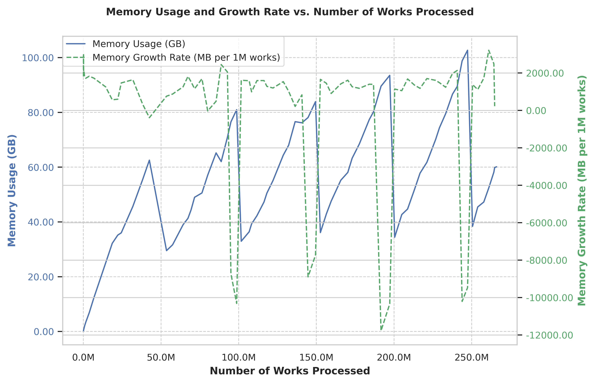

# OpenAlex Processor

A high-performance Rust application for processing OpenAlex academic data
snapshots into PySpark-ready Parquet datasets. This tool efficiently converts
compressed JSON data into optimized columnar format for large-scale academic
research analysis.

## Last run [2025-06-22]

|                    |  |
| ----------------------------------------------------------------------------- | ----------------------------------------------------------------------- |
|  |                                                                         |

## Basic Usage

```bash
cargo run --release -- -e authors,works
```

### Command Line Options

```sh
OpenAlex Academic Data Processor

Usage: openalex_processor [OPTIONS]

Options:
  -i, --input-dir <INPUT_DIR>
          Input directory containing OpenAlex snapshot [default: ../download/openalex-snapshot/data]
  -o, --output-dir <OUTPUT_DIR>
          Output directory for Parquet datasets [default: ./pyspark_datasets]
  -w, --workers <WORKERS>
          Number of parallel workers (default: 80% of cores)
  -b, --batch-size <BATCH_SIZE>
          Batch size for Parquet writing [default: 1000000]
  -e, --entities <ENTITIES>
          Entity types to process (comma-separated: authors,institutions,publishers,works,topics) [default: all]
  -f, --files-per-entity <FILES_PER_ENTITY>
          Limit files per entity for testing (0 = no limit) [default: 0]
  -h, --help
          Print help
```

## Output Structure

The processor generates the following Parquet files:

```sh
pyspark_datasets/
├── authors_counts_by_year.parquet # Annual publication/citation counts for authors
├── authors_ids.parquet            # Author external IDs
├── authors.parquet                # Author profiles
├── institutions_geo.parquet       # Geographic information for institutions
├── institutions.parquet           # Institution details
├── publishers.parquet             # Publisher information
├── topics.parquet                 # Research topics
├── works_authorships.parquet      # Author-work relationships
├── works_citations.parquet        # Citation relationships
├── works_locations.parquet        # Publication locations/URLs
├── works_open_access.parquet      # Open access information
├── works.parquet                  # Publications
└── works_topics.parquet           # Work-topic relationships
```

## License

This project is licensed under the MIT License - see the LICENSE file for
details.

## Citation

If you use this tool in your research, please cite:

```bibtex
@software{openalex_processor,
  title={OpenAlex Processor: High-Performance Academic Data Processing},
  author={[Kushagra Lakhwani]},
  year={2025},
  url={https://github.com/KorigamiK/openalex-processor}
}
```
